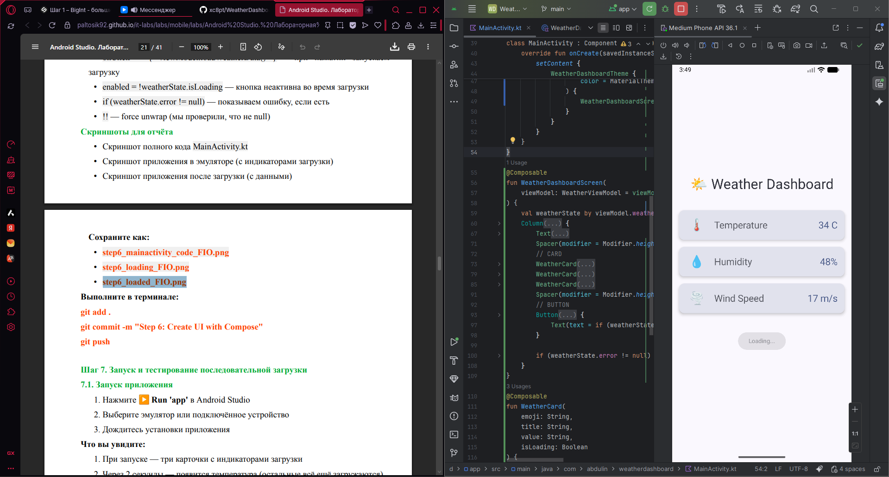
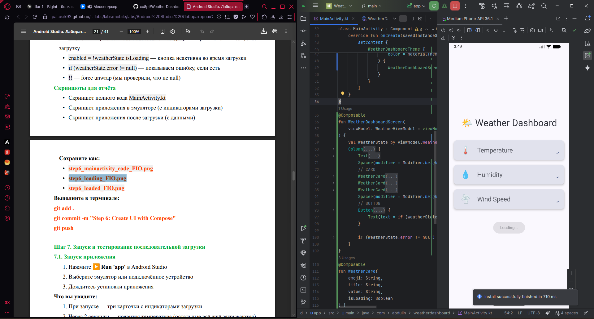
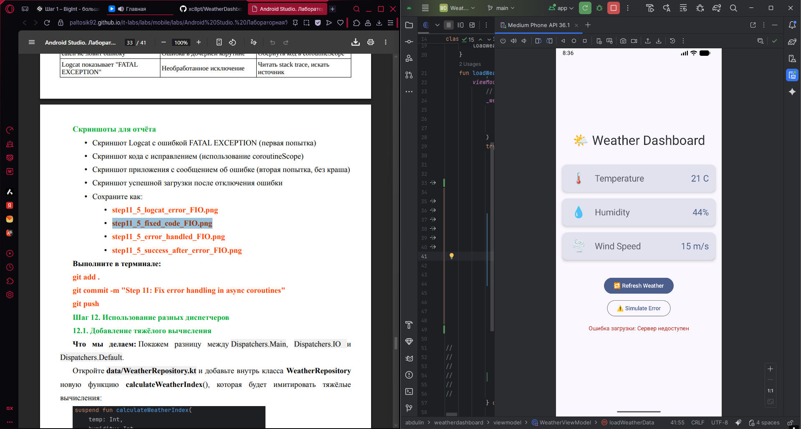

# Лабораторная работа №17-18. Корутины на практике: Метеосводка
Цель работы: Изучить основы корутин в Kotlin для создания асинхронных операций в Androidприложениях. Научиться использовать launch, async, диспетчеры корутин и обрабатывать
длительные операции без блокировки UI-потока. Создать приложение "Weather Dashboard" с
имитацией загрузки данных о погоде из разных источников.

## Функциональность приложения
- Отображение текущей температуры – показывает температуру воздуха в градусах Цельсия.
- Индикация влажности – отображает относительную влажность воздуха в процентах.
- Показ скорости ветра – выводит скорость ветра в метрах в секунду.
- Фоновое обновление данных – реализует длительные операции без перезагрузки страницы и без блокировки интерфейса.
- Автономная или кэширующая загрузка - приложение умеет работать с данными без постоянной «климатической» (вероятно, сетевой) нагрузки, то есть может использовать локально сохранённые показатели или эмулировать получение данных при отсутствии стабильного соединения.

## Технологии и библиотеки 
- **Kotlin Coroutines** – для асинхронных операций: `launch`, `async`, `await`, `delay`, `withContext`, `Dispatchers` (Main, IO, Default), `viewModelScope`, `flow`, `collect`.

- **Kotlin Flows** – для реактивного управления состоянием: `StateFlow`, `MutableStateFlow`, `asStateFlow`, а также построение бесконечного потока `flow { while(true) { delay(...); emit(...) } }`.

- **AndroidX Lifecycle ViewModel** – используется класс `ViewModel` и расширение `viewModelScope` (из `androidx.lifecycle:lifecycle-viewmodel-ktx`).

- **Стандартная библиотека Kotlin** – `data class`, `Random.nextInt`, `suspend fun`, `repeat`, работа с исключениями.

- **Kotlin Coroutines Core** / **Android integration** – неявно используется `kotlinx.coroutines` (включая `kotlinx-coroutines-core` и `kotlinx-coroutines-android` для `Dispatchers.Main`).

## Ответ на контрольные вопросы:

### В чём разница между launch и async?
- launch - не возвращает результат, используется для «запустил и забыл».
- async - возвращает результат через await(), используется для параллельных задач, когда нужны данные.
Ключевой пример:

```kotlin
// launch – нет результата
viewModelScope.launch { saveToDb() }

// async – нужен результат
val deferred = async { fetchData() }
val result = deferred.await()
```

### Что такое suspend функция?
- Suspend функция - может приостанавливаться без блокировки потока.
- Из обычной функции - нельзя, нужна корутина или runBlocking.
- delay() не блокирует поток - приостанавливает только корутину, поток свободен.

### Зачем нужны разные диспетчеры?
- Зачем? - управление потоками для оптимальной работы и неблокировки UI.

| Диспетчер | Когда       | Пример |
|-----------|-------------|----|
| Main      | 	UI	        |обновление TextView|
| IO	       | ввод-вывод	 | чтение файла, сеть |
| Default   	|CPU| сортировка, вычисления|

- Тяжёлое вычисление на Main -> блокировка UI, через ~5 сек - ANR.

### Что произойдёт, если не обработать исключение в корутине?
- Исключение не обработано -> крах приложения (или отмена родителя).

- Корректно -> `try-catch` внутри корутины или `CoroutineExceptionHandler`.

- `try-catch` в `launch` - чтобы перехватить ошибку и показать UI, не падая.

### Как работает автоматическая отмена корутин?
- Автоотмена - корутина отменяется при отмене её `Job` (отменяются дочерние).

- `viewModelScope` - привязан к `ViewModel`, отменяет все корутины при уничтожении `ViewModel`.

- Автоматически - когда умирает `ViewModel`.


## Как запустить проект
- Откройте проект в **Android Studio** (скопируйте файлы: `WeatherData.kt`, `WeatherRepository.kt`, `WeatherViewModel.kt` и активити/фрагмент с UI).
- Подключите зависимости в `build.gradle (Module: app)`:
```
implementation "org.jetbrains.kotlinx:kotlinx-coroutines-android:1.7.3"
implementation "androidx.lifecycle:lifecycle-viewmodel-ktx:2.6.2"
```
---
- Нажмите Run - выберите эмулятор или реальное устройство. Приложение само начнёт загружать погоду с симуляцией задержек и автоматически обновлять данные каждые 10 секунд.


## Скриншоты работы приложения

---

---


## Автор и дата
**Абдулин Ринат ИСП-233** *04.04.2026 0:18*